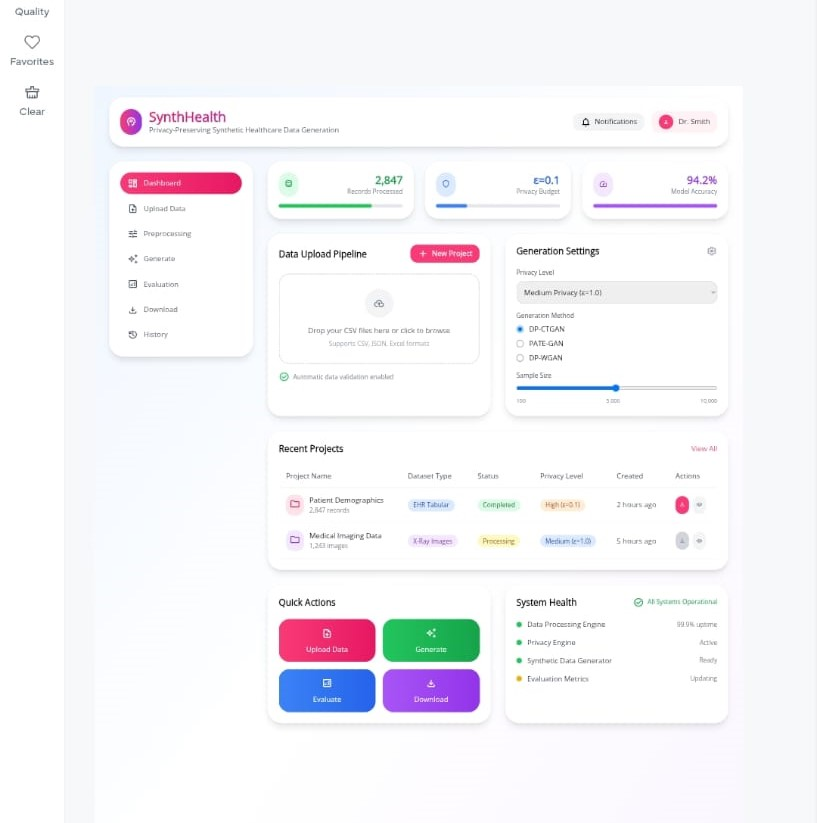

# MeddiiSynx: Synthetic Healthcare Data Generation Platform

MeddiiSynx is a full-stack web application designed for generating high-fidelity synthetic healthcare data. It provides a user-friendly interface to upload real patient data, select from advanced generative models (like DP-GAN and CT-GAN), and produce privacy-preserving synthetic datasets. The platform includes a suite of evaluation metrics to assess the quality and privacy of the generated data.



## Features

- **Modern UI**: A sleek, responsive interface built with Next.js, TypeScript, and Tailwind CSS.
- **Interactive Data Workflow**: Upload, configure, generate, and evaluate synthetic data through a multi-step wizard.
- **Advanced Generative Models**: Integrates with `synthcity` to offer state-of-the-art models like DP-GAN, CT-GAN, and PrivBayes.
- **Data Preprocessing**: Automatically handles file validation, previewing, and summary statistics.
- **In-depth Evaluation**: Provides a suite of metrics to evaluate data mismatch, privacy leakage, and feature distribution similarity.
- **Secure File Handling**: Manages data uploads and downloads through a secure FastAPI backend.
- **Python Backend**: A robust backend powered by FastAPI, handling all data processing and generation tasks.

## Project Structure

```
.
├── backend/
│   ├── api/          # FastAPI endpoints (auth, generate, evaluate, etc.)
│   ├── outputs/      # Directory for generated synthetic data
│   ├── main.py       # Main FastAPI application
│   └── requirements.txt
│
└── frontend/
    ├── app/          # Next.js 13+ app directory structure
    ├── components/   # Reusable React components
    ├── pages/        # Main application pages
    └── package.json
```

## Getting Started

### Prerequisites

- Python 3.9+
- Node.js 18.0+ and npm/pnpm/yarn
- A C++ compiler (required for some `synthcity` dependencies)

### Backend Setup

1.  **Navigate to the backend directory**:
    ```bash
    cd backend
    ```

2.  **Create a virtual environment and activate it**:
    ```bash
    python -m venv venv
    source venv/bin/activate  # On Windows, use `venv\Scripts\activate`
    ```

3.  **Install Python dependencies**:
    ```bash
    pip install -r requirements.txt
    ```

4.  **Run the backend server**:
    ```bash
    uvicorn main:app --reload --host 0.0.0.0 --port 8000
    ```
    The backend will be available at `http://localhost:8000`.

### Frontend Setup

1.  **Navigate to the frontend directory**:
    ```bash
    cd frontend
    ```

2.  **Install Node.js dependencies** (using pnpm is recommended):
    ```bash
    pnpm install
    ```

3.  **Run the frontend development server**:
    ```bash
    pnpm run dev
    ```
    The frontend will be available at `http://localhost:3000`.

## Usage

1.  **Open the Application**: Navigate to `http://localhost:3000` in your browser.
2.  **Upload Data**: In the "Data Lab", use the "Upload" tab to select and upload a real CSV dataset.
3.  **Configure**: Choose an AI model (e.g., DP-GAN) and configure privacy or preprocessing settings.
4.  **Generate**: Click "Start Generation" to begin the synthetic data creation process.
5.  **Evaluate & Download**: Once complete, the "Results" tab will display the evaluation metrics. You can then download the newly generated synthetic dataset. 